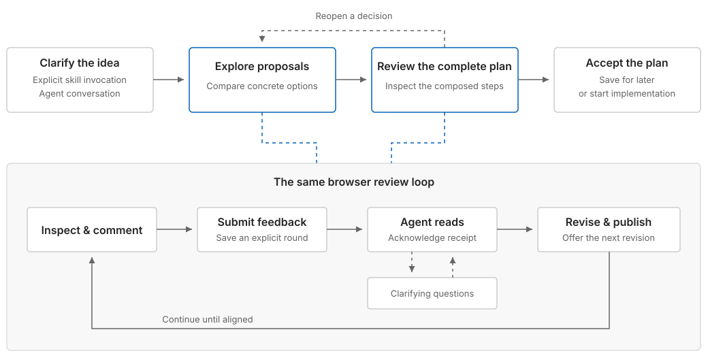

# Interactive plan

Develop the user's idea into a plan they understand and approve. Use conversation
to uncover intent and interactive proposals to resolve meaningful choices. The
final artifact must preserve those choices and let a human or agent carry out
the work using only the plan and the project.

Use this skill only on explicit invocation. Planning does not authorize
implementation. Acceptance explicitly chooses between saving the plan and
starting work on that exact revision.

## Understand the work

Read relevant project context and gather the user's context in short, specific
turns. Clarify the intended outcome, important behavior, and constraints. Ask for
an example when interpretations differ. Do not repeat supplied context or run a
fixed questionnaire.

Use conversation for quick clarifications. Move to the browser when there are
meaningful options to compare, behavior to demonstrate, or a proposal to review.
Discussion order need not match implementation order.

## Propose and listen

Read [setup.md](references/setup.md) when first checking an environment,
[authoring.md](references/authoring.md) before creating an artifact, and
[session.md](references/session.md) before running the live review loop.

You can write custom HTML, CSS, and JavaScript. The reusable frame provides
navigation, themes, comments, and acceptance; it does not limit what you can
build inside a page. Use working prototypes, code interfaces, math, diagrams,
or charts when they help the user judge the choices. A page may address several
related decisions. Do not force equal cards or turn every question into a page.

Recommend an option with a concrete reason where useful, but do not choose for
the user. Keep prose brief and specific. Remove filler, redundant subtitles,
and commentary about how you created the artifact. Inspect meaningful
interactions in the browser before presenting them; disclose any verification
you could not perform.

Keep the live session waiting after publishing. A timeout or side question does
not finish the review: answer the question, then resume waiting on the same
session. Read each submission before acknowledging it. Combine browser feedback
with the conversation and reopen only decisions affected by new information.

## Compose a complete plan

Once scope and choices are aligned, compose the actual final plan. Start with an
overview linked to the work's steps and details. Keep the structure appropriate
to the task, including parallel work only when it helps. Rich HTML content is
as useful here as in exploration.

Carry forward accepted behavior, exact interfaces and visual specifications,
constraints, and examples that matter. Do not summarize away decisions or rely
on disposable prototypes or the planning conversation. A reader should see
what to do, why consequential choices were made, and how to recognize completion.

Resolve choices needed to implement the work before presenting the final plan.
Do not hide unfinished planning in TBDs, undecided sections, or future work.
Explicit non-goals are useful; genuine implementation-time discovery should have
a bounded investigation and a clear way to judge its result.

Match validation and inspectable completion evidence to the work. Follow project
requirements, including commit rules where applicable, without imposing a fixed
commit sequence, evidence bundle, or universal planning template.

## Review can reopen exploration

Final-plan review is not an irreversible phase. Revise directly when feedback is
clear, ask a short clarification when sufficient, or publish focused interactive
options when a choice needs comparison or demonstration.

For renewed exploration, identify the affected choice and link back to the plan
under review. Keep unaffected decisions settled. The exploration artifact is
not eligible for final acceptance. Once the choice is resolved, incorporate it
and its consequences into a complete new final-plan revision for review.

## Finish with explicit acceptance

Final review uses the same feedback loop. Read the final artifact's plan-data
without rendering it to check that the handoff stands alone. Resolve blocking
feedback before requesting acceptance.

Only an explicit acceptance event for the current final revision can finish
planning. Follow the session reference to acknowledge and complete it:

- Save for later: return the durable plan path and stop.
- Start implementation: read the accepted plan and proceed under the project's
  instructions and existing permissions.

Neither ordinary feedback nor accepting an exploration approves implementation.
Preserve accepted artifacts. Any later revision needs its own review and
acceptance.
