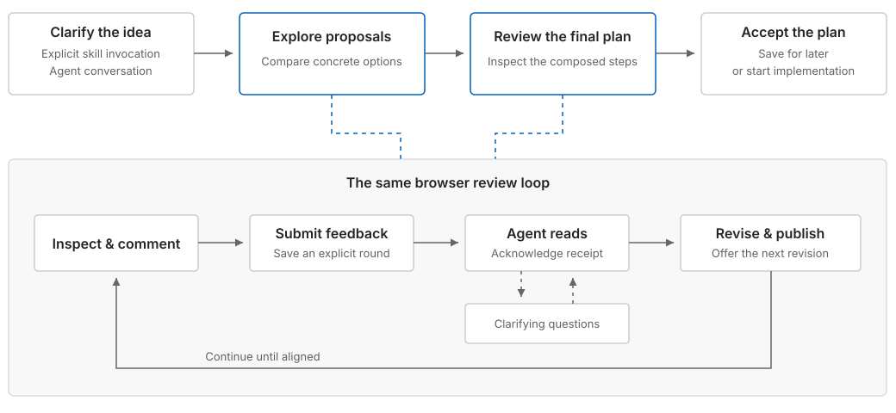

# Plan interactively

Use this skill only on explicit invocation. Do not implement the proposed work
while exploring or reviewing a plan. Final acceptance has two distinct outcomes:
save for later, or explicit permission to begin implementing that exact plan.



## Understand the intended work

Read relevant project context, then gather the user's context. A short feature
description is not enough by itself. Use short, specific turns to understand the
problem, intended outcome, important behavior, constraints, and non-goals. Ask
for an example when several interpretations remain plausible.

Move to the browser once you can propose meaningful alternatives grounded in
that intent. Do not try to settle every design choice in the terminal or run a
fixed questionnaire. If the user already supplied the context, avoid redundant
questions. Summarize your understanding briefly when uncertainty still affects
the proposal.

## Start an isolated session

Read [authoring.md](references/authoring.md) before creating the first artifact.
Use the checked [frame](assets/frame.html), retaining its shared controls and
library defaults. The [helper](scripts/session.mjs) needs Node 20+ and no installed
packages. Resolve these paths relative to this skill, not the project directory.

Run the helper through a long-running tool process:

```sh
node scripts/session.mjs start
```

Keep the returned session directory and URL in the active conversation. Every
subsequent command requires `--session-dir PATH`. Do not use a shared current-
session file. Keep generated artifacts and feedback outside project history.

If a session already exists, inspect its status and queued feedback rather than
creating a replacement. Resume its helper with `start --session-dir PATH`.
A live owner prevents a second writer. After an abnormal shutdown, inspect the
old owner before using `--recover-lock`; do not delete ownership files blindly.

## Propose and listen

Build freely composed pages with concrete options and relevant recommendations.
Use working prototypes, code interfaces, math, diagrams, or charts when they
help the user judge the work. A page may resolve several related ambiguities.
Discussion order need not match implementation order. Do not select an option
on the user's behalf or reopen settled choices without a reason.

Write a complete artifact, then publish it:

```sh
node scripts/session.mjs publish --session-dir PATH --file ARTIFACT.html
node scripts/session.mjs wait --session-dir PATH --timeout 55
```

Present the returned URL and keep the agent turn waiting. A timeout is not
completion; wait again. A side question does not end the session: answer it,
then resume the same wait. The helper saves feedback but cannot awaken an ended
agent turn. If the conversation is interrupted, the next turn must resume the
explicit session and read its queue.

When an event arrives, read its `payload`, including intent and source revision,
then acknowledge the event ID:

```sh
node scripts/session.mjs ack --session-dir PATH --id SUBMISSION_ID
```

A saved receipt is not an agent acknowledgement. Do not acknowledge unread
feedback. Combine it with the conversation, revisit affected decisions, and
either revise the proposal or ask a focused clarification.

```sh
node scripts/session.mjs question --session-dir PATH --text "QUESTION"
```

The browser offers a dedicated reply field. Continue waiting for its event.
The user can also answer in the agent conversation; resolve that question with
`working --session-dir PATH` before proceeding so late browser replies cannot
replace the answer. Do not create a separate chat transport.

Publish each revision under a new revision identifier. Preserve old snapshots
and attach feedback to what the user actually saw. If asked to return to an older
proposal, use it as the baseline for a new revision and explicitly reconsider
later decisions. Do not delete later history or build a branch manager.

## Compose the final plan

When scope and choices are aligned, say that exploration is complete and compose
the actual final plan. Only then expose its review link. Do not present a demo
plan alongside exploration and leave the user to infer which is authoritative.

Use the same frame, theme control, comments, and feedback page. Start with an
overview linked to implementation steps. Carry forward the detail a new agent
needs: accepted behavior, exact interfaces and visual specifications, relevant
examples, constraints, dependency order, and task-specific completion checks.
Rich content remains available inside every step. Do not summarize away the
decisions or rely on the conversation or disposable prototypes as the handoff.

Match validation and review evidence to the work. Specify how a person can
inspect completion when it matters, including useful PR artifacts where
appropriate. Avoid a mandatory evidence bundle for every task.

Final-plan feedback uses the same loop. Resolve blocking questions and requested
changes before acceptance. Preserve full semantic content in `plan-data` so an
implementing agent can read the HTML without running its browser UI.

## Honor the acceptance choice

An `accept-plan` event must explicitly contain `mode`:

- `save`: acknowledge, complete planning, and return the durable plan path.
  Do not begin implementation.
- `implement`: acknowledge, complete planning, and read the accepted plan from
  the returned path. Continue implementation under the project's instructions,
  isolation requirements, and existing permissions. This does not authorize
  unrelated actions or remove a need for approval of restricted operations.

```sh
node scripts/session.mjs complete --session-dir PATH
```

Check the returned `nextAction` and `planPath`. Do not infer execution permission
from a feedback message, a recommendation, an acknowledgement, or mere plan
acceptance without the explicit mode. The helper never executes plan content.

Leave accepted artifacts and the acceptance record intact when the helper stops.
For later changes, reopen review on a new revision; old acceptance does not
approve modified content.
