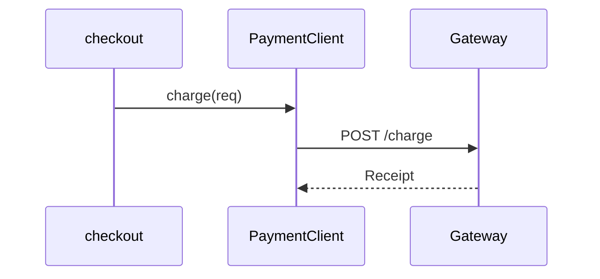
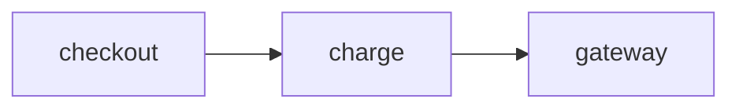
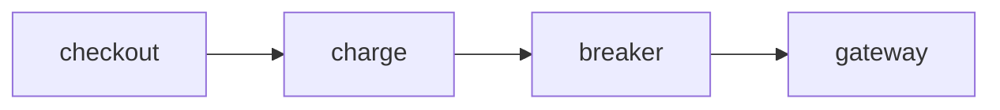

# Blocks

Anything visual is a fenced block. The first word of the info string names it,
the rest is its argument, and the body is its data. A block the grammar cannot
read keeps its source on the page with the reason, so a mistake is visible
rather than silent.

Locations are one grammar everywhere: `PATH[@REF][:START[-END]]`. `PATH` is
repository-relative. `REF` is any ref the helper accepts, including `pr/N`;
omitted, it is the session's ref.

## Diagram

Use it for how parts relate, a sequence, or a state machine. Do not use it to
restate a list. When the page has one, lead with it.

````markdown

````

A node whose label is a real location becomes a chip that opens the code.

## Code excerpt

Use it when the actual lines answer the question. Do not use it to show code
the prose already explains, and do not paste a whole file.

````markdown
```code src/client.py@main:42-48
42  The loop. Up to five attempts.
46  Backoff doubles from 0.5s, capped at 30s.
```
````

Each `N  text` line is a margin note beside line N. Continuation lines are
indented. At most three notes; annotate only what the code cannot say itself.

## Diff

Use it for what a change did, including against a pull request head. Do not use
it to show a file that did not change.

````markdown
```diff main..pr/123 services/payments/retry.py
The breaker short-circuits before the loop and records each failure inside it.
```
````

The body is prose shown above the diff. Either ref may be `pr/N`.

## Walkthrough

Use it for an ordered path through several files. Do not use it for two steps
in one file; an excerpt is clearer.

````markdown
```steps
1. services/api/checkout.py@main:57
   Checkout builds a ChargeRequest.
2. services/payments/client.py@main:42
   charge() enters the retry loop.
```
````

The reader moves through the steps and the code pane follows.

## Before and after

Use it when the shape of something changed. Do not use it when one diagram with
a sentence would do.

````markdown
::: compare Before | After PR #123





:::
````

`class NODE added|removed|changed` marks what differs, and the legend explains
the colors.

## Choice

Use it when the question is broad enough to have real directions. Do not use it
to offer trivia, and never with fewer than two or more than four options.

````markdown
```choose Where next?
- The write path, from charge to ledger
- The read path, from receipt to statement
- Failure handling: retries, breaker, timeouts
```
````

Picking one asks it as the next question on that page.

## Math

Use it when a formula is the clearest statement of a rule. Do not use it to
dress up arithmetic.

```markdown
The wait before attempt $n$ is

$$\text{delay}_n = \min(0.5 \cdot 2^{n}, 30)$$
```

## Chart

Use it when a quantity is the point. Do not use it for three numbers a sentence
could carry.

````markdown
```chart Backoff per attempt
{ "type": "bar", "x": [1, 2, 3, 4, 5], "y": [0.5, 1, 2, 4, 8], "unit": "seconds" }
```
````

One JSON object: `type` is `bar` or `line`, `x` and `y` are equal-length arrays,
`unit` labels the y axis.

## Notes

Use it to annotate a file or a diff the page is not showing. Do not use it to
repeat a margin note you already wrote on an excerpt.

````markdown
```notes services/payments/client.py@main
42-48  The retry loop. Up to five attempts, then GatewayExhausted.
46     Capped at 30s because the gateway drops idle connections at 60s.
```
````

For a diff, the target is `BASE..HEAD PATH` and a range is `+N` or `-N` for the
added or removed side. The page shows only "n notes on PATH"; the notes appear
as numbered markers in the gutter wherever that file or diff is opened, in this
session and in the export.

## Added sections

A follow-up that extends a page goes inside `::: added` … `:::`, which the page
marks as added after the reader's question.

## References

Inline code that names a real file becomes a chip: `` `src/client.py` ``,
`` `src/client.py:42` ``, `` `src/client.py:42-48` ``, `` `src/client.py@main:42` ``.
Code that is not a path stays ordinary code. Do not write a path you have not
confirmed; a chip that does not resolve is just code.
