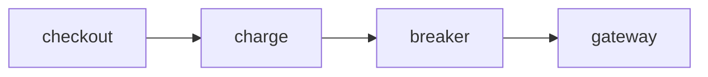

```diff main..pr/7 src/client.py
The breaker short-circuits before the loop and records each
failure inside it.
```

::: compare Before | After PR #7




:::

```notes main..pr/7 src/client.py
+2   The breaker check runs before the loop, so an open breaker
     fails fast instead of retrying five times.
-1   Every retryable failure used to reach the gateway.
```
