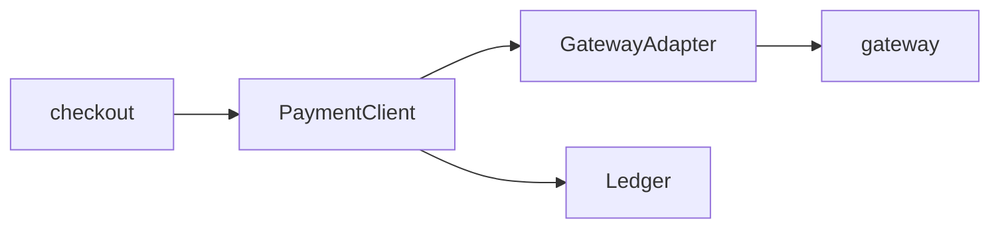

Three abstractions carry every charge. Everything else is glue.

The loop is `submit` in `src/session.py:345-357`; its limit lives in
`src/client.py:2` and the adapter in `src/gateway.py`. Only `RetryableError`
is retried.
